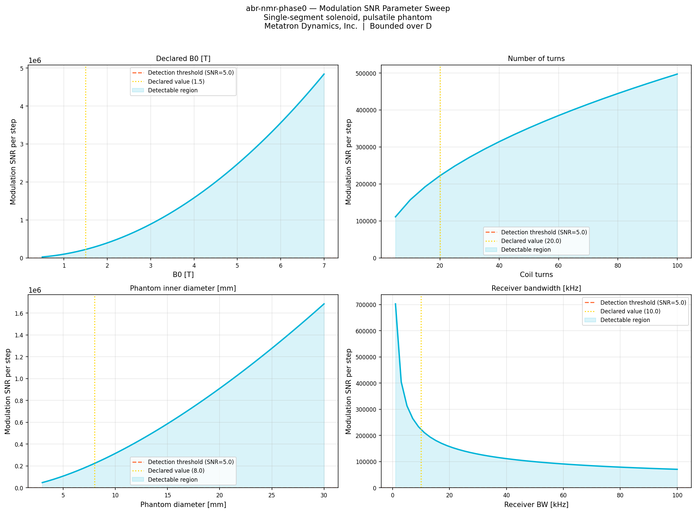
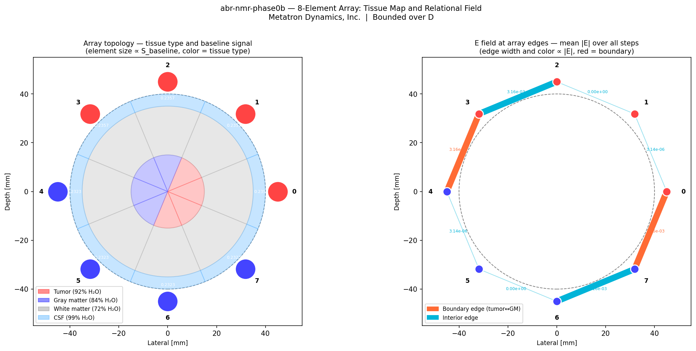
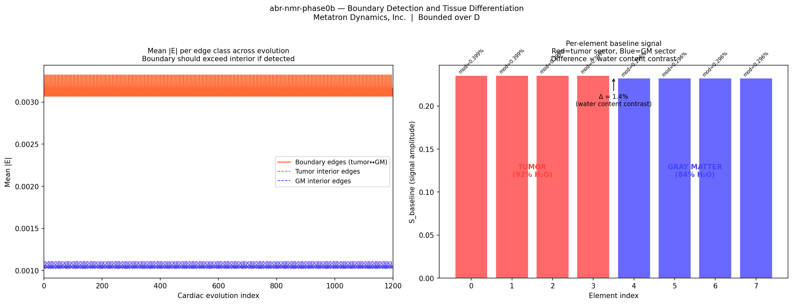
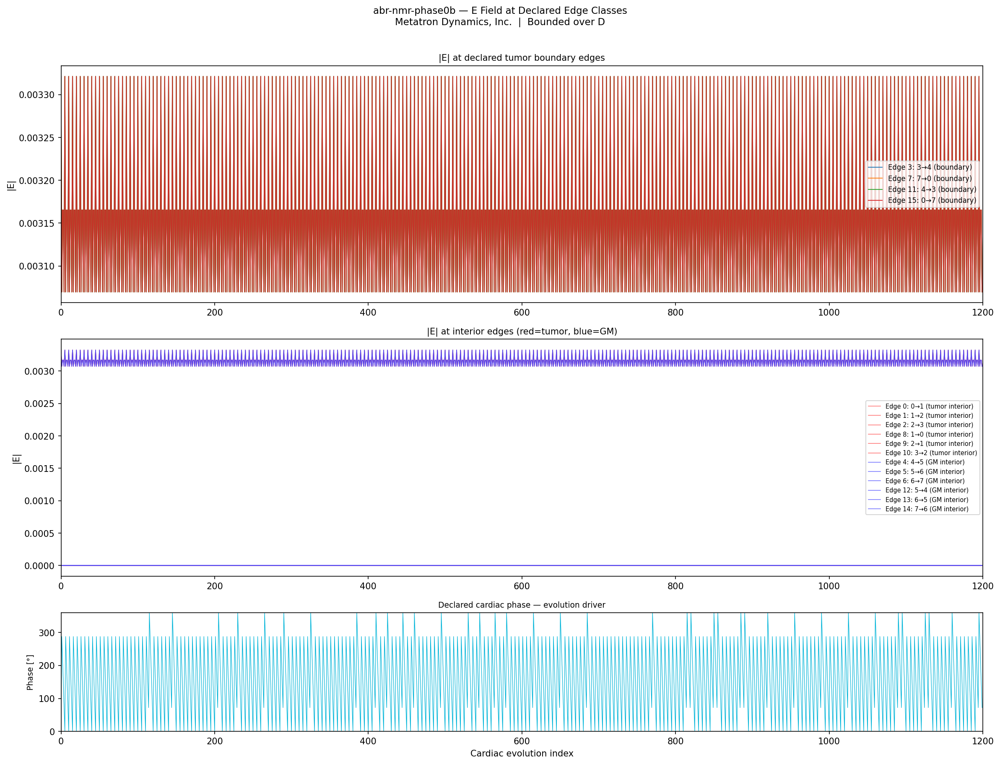
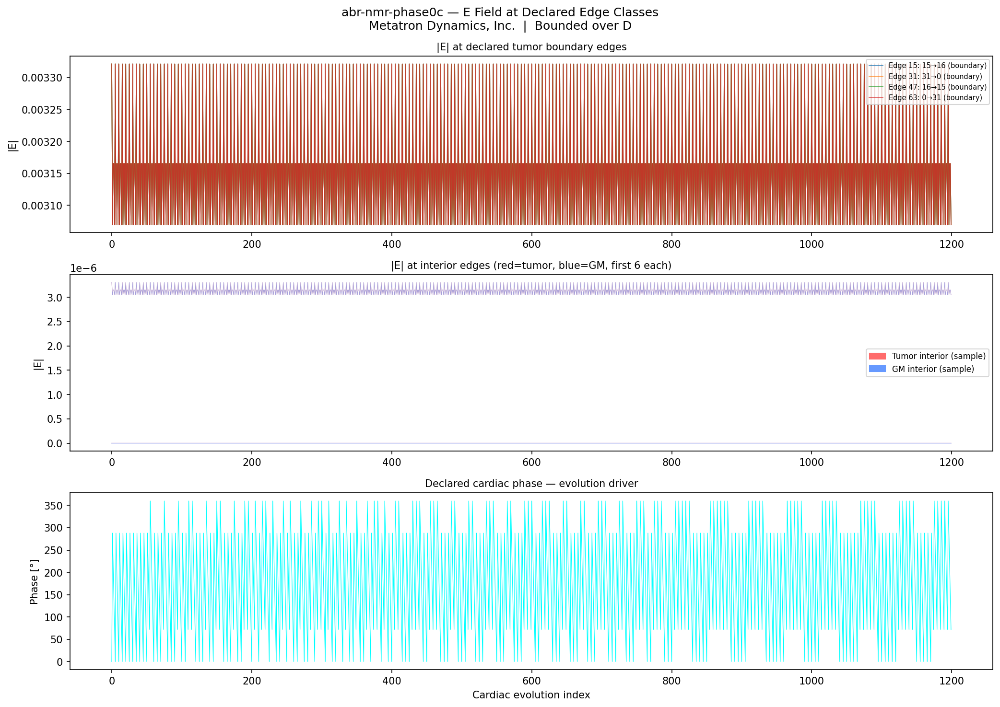
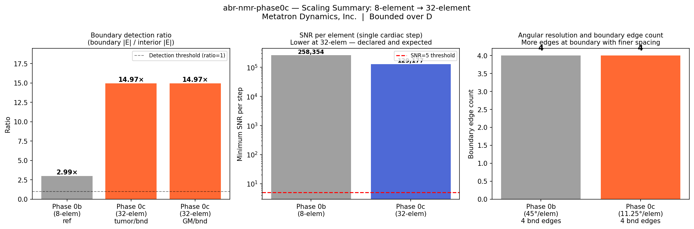
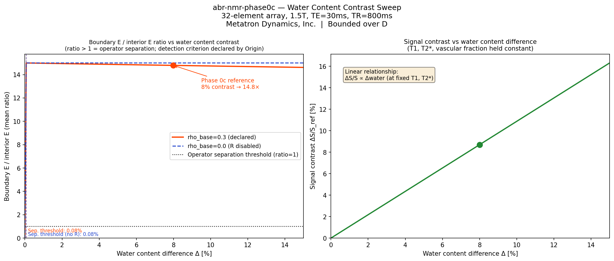

# abr-nmr-sensor
## Metatron Dynamics, Inc.

**Relational NMR Receiver Array — Phase 0 through Phase 0c simulations.**

A segmented cylindrical solenoid array detects tissue boundaries from water content contrast alone — no Fourier encoding, no temporal averaging, no spatial reconstruction. This repository establishes the physics of that claim through a declared simulation pipeline at 1.5T.

→ [Investor overview](docs/investor_overview.md)

---

### What this repository establishes

**Phase 0** — Single-element solenoid, pulsatile phantom.
Validates that cardiac pulsatility-driven T2* modulation is detectable above the thermal noise floor in a single cardiac step at 1.5T.

**Phase 0b** — 8-element segmented array, 4-tissue phantom.
Validates that the ABR kernel detects declared tissue boundaries from water content contrast between adjacent array elements.

**Phase 0c** — 32-element array, 11.25° angular spacing.
Validates element count scaling. Establishes boundary detection ratio at 32-element resolution with per-element SNR analysis.

**Water content sweep** — 0–15% water content difference, 200 steps.
Characterizes operator separation across the full contrast range. Establishes that the separation threshold is set by SNR, not by operator sensitivity.

---

### Key Results

| Metric | Value |
|--------|-------|
| Phase 0 SNR per cardiac step | 113,708 |
| Phase 0 modulation SNR per step | 91,940 |
| Phase 0 detectable in single step | YES |
| Phase 0 minimum viable B0 | 0.5T |
| Phase 0b boundary E / interior E | 2.99× (8-element) |
| Phase 0c boundary E / interior E | 14.97× (32-element) |
| Phase 0c SNR per element per step | >129,000 |
| Phase 0c water content contrast | 8% (tumor 92% vs GM 84%) |
| Sweep operator separation | Confirmed, 0–15% Δwater |
| Contrast origin | A field — verified at rho_base=0 |
| All tests passing | 38/38 (Phase 0c) |

All results are simulation results at declared 1.5T parameters grounded in published NMR tissue values. No empirical fitting. No statistical proxies. All operator assertions derive from declared formulas.

---

### Figures

**Phase 0 — Modulation SNR parameter sweep**


**Phase 0b — 8-element array: tissue map and relational field**


**Phase 0b — Boundary detection and tissue differentiation**


**Phase 0b — E field at declared edge classes**


**Phase 0c — E field at declared edge classes (32-element)**


**Phase 0c — Scaling summary: 8-element → 32-element**


**Water content contrast sweep — operator separation threshold**


---

### How the operators work

The ABR kernel — `E(x,ρ) = R(B(A(x)), ρ(A(x)))` — acts on the per-element signal field:

- **A** extracts directed signal differences across declared adjacent element pairs
- **B** accumulates those differences along declared coil continuation
- **R** couples adjacent elements through their asymmetry, scaled by local contrast
- **E** is the kernel output: the relational field across all declared element pairs

Any reduction of E — to a boundary ratio, to a per-element scalar — is a declared application-layer projection that states what it preserves and what it discards. The detection criterion is Origin's declaration, not the operator's output.

The coil geometry determines the declared relations between receiver elements. Those declared relations — adjacency and continuation — form the domain over which the operators act.

---

### Repository Structure

```
sim/
    __init__.py
    declaration.py          Phase 0 domain declaration
    signal.py               Phase 0 spin echo signal model
    noise.py                Phase 0 thermal noise and SNR model
    declaration_0b.py       Phase 0b domain — 8-element array, 4-tissue phantom
    signal_0b.py            Phase 0b per-element signal model
    operators_0b.py         ABR operators for 8-element array
    declaration_0c.py       Phase 0c domain — 32-element array, 11.25° spacing
    signal_0c.py            Phase 0c per-element signal model
    operators_0c.py         ABR operators for 32-element array (vectorized)

experiments/
    run_phase0.py           Phase 0 entry point and parameter sweep
    run_phase0b.py          Phase 0b entry point and boundary detection
    run_phase0c.py          Phase 0c entry point and boundary detection
    run_water_content_sweep.py   Operator separation sweep, 0–15% Δwater
    outputs/                Generated figures and reports

tests/
    test_phase0.py          Verifier tests — Phase 0
    test_phase0b.py         Verifier tests — Phase 0b
    test_phase0c.py         Verifier tests — Phase 0c (38 tests)

docs/
    investor_overview.md        Framework demonstration document
    relational_nmr_sensor_build_plan.md   Phase 1 hardware build plan
```

---

### Run

```powershell
pip install -r requirements.txt

# Phase 0 — single element
python experiments\run_phase0.py

# Phase 0b — 8-element array
python experiments\run_phase0b.py

# Phase 0c — 32-element array
python experiments\run_phase0c.py

# Water content sweep
python experiments\run_water_content_sweep.py

# All tests
pytest
```

---

### Declared Open Conditions

- All SNR values use declared component parameters. Actual bench SNR will differ from skin effect, parasitic capacitance, and sample loading. Phase 1 hardware validates against these declared values.
- Tissue mix fractions are geometric approximations for a cylindrical phantom. Real tissue boundaries are not perfectly sharp or cylindrically symmetric.
- The 32-element array adjacency is a directed ring — admissible because the physical coil is a closed cylinder and the ring relation is produced by the sensor geometry, not declared by default.
- The water content sweep holds T1, T2*, and vascular fraction constant to isolate the water content effect. Real tissue contrast involves all parameters simultaneously.
- The operator separation threshold (ratio > 1) is not a detection criterion. Detection depends on a declared decision rule — that declaration belongs to Origin.

---

### Framework

This repository is one application of the Metatron Dynamics ABRCE relational operator framework. The same kernel has been applied to supply chain early warning, atmospheric monitoring, LLM alignment drift, and magnetospheric dynamics.

- Framework documentation: [relationalrelativity.dev](https://relationalrelativity.dev)
- arXiv publication: [2601.22389](https://arxiv.org/abs/2601.22389)
- All repositories: [github.com/Relational-Relativity-Corporation](https://github.com/Relational-Relativity-Corporation)

---

*Bounded over D. No claim beyond D.*
*Metatron Dynamics, Inc. · Delaware C-Corp · File No. 10551645*
